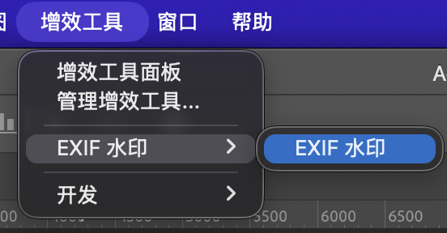
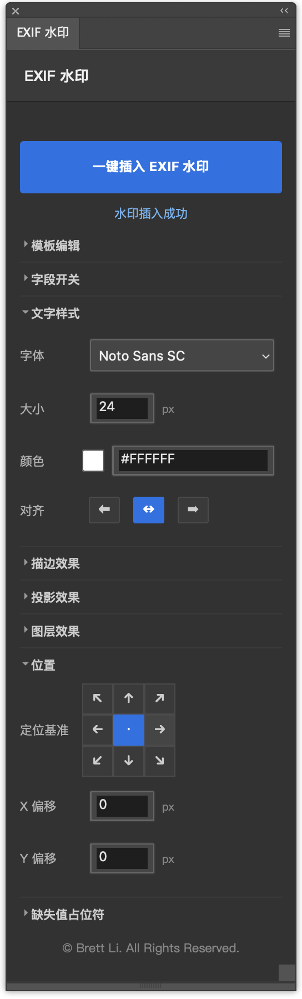
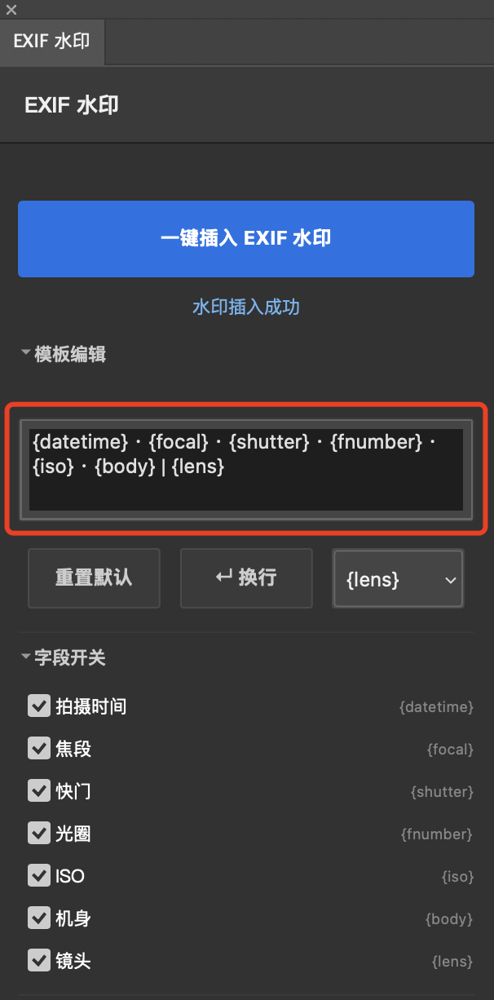
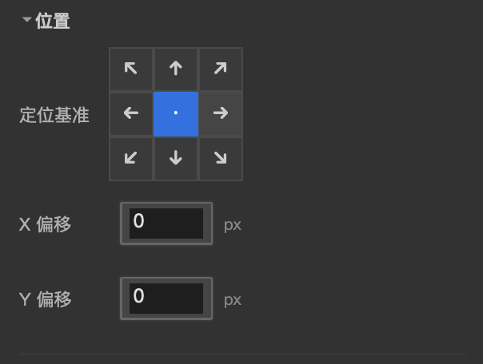

# EXIF 水印插件使用说明

> 版本：v1.1.0 | 适用平台：Adobe Photoshop 2025（v26.0+）| 支持系统：macOS / Windows

---

## 一、安装插件

### macOS

1. 双击 `exif-watermark-plugin-v1.1.0.ccx` 文件
2. Photoshop 会自动启动 Creative Cloud 桌面应用完成安装
3. 重启 Photoshop，在菜单「窗口 > 增效工具面板」中找到「EXIF 水印」



### Windows

1. 双击 `exif-watermark-plugin-v1.1.0.ccx` 文件
2. 若系统未关联 .ccx 格式，右键选择「使用 Creative Cloud 打开」
3. 重启 Photoshop，在菜单「窗口 > 增效工具面板」中找到「EXIF 水印」

> **注意**：首次安装后务必重启 Photoshop，否则插件可能无法出现在面板列表中。

### 没有 Creative Cloud 如何安装？

如果你的电脑没有安装 Adobe Creative Cloud 桌面应用，或者双击 .ccx 文件没有反应，可以手动安装：

1. **重命名文件**：将 `.ccx` 后缀改为 `.zip`（如 `exif-watermark-plugin-v1.1.0.ccx` → `exif-watermark-plugin-v1.1.0.zip`）

2. **解压文件**：用任意解压工具（Windows 自带 / 7-Zip / WinRAR、macOS 自带 / The Unarchiver）解压，会得到一个插件文件夹

3. **复制到 Plug-ins 目录**：
   - **Windows**：`C:\Program Files\Adobe\Adobe Photoshop [版本]\Plug-ins`
   - **macOS**：`/Applications/Adobe Photoshop [版本]/Plug-ins`

4. **重启 Photoshop**，插件会出现在「增效工具面板」菜单中

> **注意**：复制的是**整个解压后的文件夹**，不是单个文件。

---

## 二、界面概览

打开插件后，你会看到一个固定在右侧的窄面板，宽度约 260 px。面板自上而下分为几个区域：



最上方是「一键插入 EXIF 水印」按钮和状态栏。下方是若干可折叠的功能区域。默认只有「文字样式」和「位置」是展开的，其他区域点击标题即可展开或折叠。

---

## 三、基础使用流程

### 第一步：打开照片

在 Photoshop 中打开一张包含 EXIF 信息的照片（JPG、TIFF、RAW 格式均可）。插件会自动读取照片中的元数据。

> 如果照片未保存过（新建的空白文档），插件仍可工作，但部分 EXIF 字段可能无法读取，状态栏会提示「Exif 信息不全」。

### 第二步：选择要显示的字段

展开「字段开关」区域，勾选你想显示在水印中的信息。以下示例数据来自一张尼康 Z 9 拍摄的样片：

| 字段 | 占位符 | 说明 | 示例输出 |
|------|--------|------|---------|
| 拍摄时间 | `{datetime}` | 照片原始拍摄时间 | 2026-04-04 15:30 |
| 焦段 | `{focal}` | 拍摄时的等效焦距 | 105mm |
| 快门 | `{shutter}` | 曝光时间 | 1/8000s |
| 光圈 | `{fnumber}` | 拍摄时的光圈值 | f/4 |
| ISO | `{iso}` | 感光度 | ISO 1250 |
| 机身 | `{body}` | 相机型号 | NIKON Z 9 |
| 镜头 | `{lens}` | 镜头标识（部分照片可能缺失） | NIKKOR Z MC 105mm f/2.8 VR S |

### 第三步：编辑水印模板

展开「模板编辑」区域，你会看到一个文本框和一组工具按钮。默认模板为：

```
{datetime} · {focal} · {shutter} · {fnumber} · {iso} · {body} | {lens}
```



你可以在模板中：
- **插入字段**：点击「插入字段」下拉框选择字段，自动插入 `{字段名}` 占位符
- **自由输入文字**：直接打字，比如 `Shot on`、分隔符 `|` 等
- **换行**：点击「↵ 换行」按钮插入换行符
- **重置模板**：点击「重置默认」按钮恢复默认模板

> 如果某个字段在当前照片中无法读取，插件会用占位符（默认 `--`）替代。你可以在「缺失值占位符」区域自定义这个符号。

### 第四步：调整样式

**文字样式**（默认展开）：
- **字体**：下拉选择，显示的是字体族名，底层自动使用正确的 PostScript 名
- **大小**：0.01 ~ 1296，默认 24
- **颜色**：点击色块打开调色板，42 色快速选择，或输入 HEX 值
- **对齐**：左对齐 / 居中对齐 / 右对齐

**位置**（默认展开）：
- 点击九宫格按钮选择水印位置
- 用「X 偏移 / Y 偏移」进行微调（单位：px）



上图标注了 9 个定位基准。偏移量为正时，X 向右、Y 向下移动。

### 第五步：添加效果（可选）

**描边效果**：
- 勾选「启用描边」
- 颜色：与文字颜色同样的选择方式
- 宽度：0 ~ 250 px（默认 2 px）

**投影效果**：
- 勾选「启用投影」
- 混合：正常 / 正片叠底 / 滤色 / 叠加 / 柔光 / 强光 / 差值 / 排除 / 颜色 / 亮度
- 颜色：与文字颜色同样的选择方式
- 不透明度：0 ~ 100%（默认 85%）
- 角度：拖拽轮盘或输入数值（-180° ~ 180°，默认 134°）
- 距离：0 ~ 3000 px（默认 14 px）
- 扩展：0 ~ 100%（默认 20%）
- 大小：0 ~ 250 px（默认 24 px）


角度轮盘表示光源方向。默认 134° 表示光从左上照射，阴影落在右下。

**图层效果**：
- **不透明度**：0 ~ 100%（默认 100%）
- **混合模式**：正常 / 正片叠底 / 滤色 / 叠加 / 柔光 / 强光 / 差值 / 排除 / 颜色 / 亮度

### 第六步：生成水印

点击顶部的「一键插入 EXIF 水印」按钮。插件会：

1. 读取照片 EXIF 信息
2. 根据模板渲染文字
3. 创建文字图层
4. 移动到指定位置
5. 应用描边和投影效果

整个过程通常在一秒内完成。下图是实际生成效果：


---

## 四、界面详解

### 折叠面板

点击每个区域标题（如「投影效果」）可以展开或折叠该区域。展开状态下标题旁显示 ▾，折叠状态下显示 ▸。默认仅「文字样式」和「位置」是展开状态。

### 颜色选择器

点击颜色方块会弹出 42 色调色板。调色板以 6 行 × 7 列排列，涵盖黑白灰、常见色相和高饱和度颜色。点击任意色块立即生效，再次点击同一位置关闭调色板。

### 角度轮盘

角度轮盘是一个圆形控件，中心有小圆点表示当前角度方向：
- **鼠标拖拽**：按住圆点拖拽到想要的方向
- **直接输入**：旁边的数字框可精确输入角度
- 角度与 Photoshop 原生投影角度一致，但不受全局光影响

### 字段标签高亮

在「字段开关」区域，勾选字段后对应的标签会变亮，未勾选时标签变暗。这样可以一眼看出哪些字段会出现在水印中。

---

## 五、使用技巧

### 批量处理不同照片

插件不会保存图层样式为预设。但你可以在生成水印后，手动将图层样式保存为 Photoshop 的「图层样式」预设（右键图层 › 混合选项 › 新建样式），下一张照片直接应用即可。

### 水印尺寸适配

如果水印在高分辨率照片上显得太小：
1. 在「文字样式」中适当增大字号
2. 或者缩小照片视图（Ctrl/Cmd + -），观察相对大小

### 复杂背景下的可读性

背景杂乱时，推荐组合使用：
- 白色文字 + 黑色描边（2 px）+ 轻微投影（距离 3 px，不透明度 40%）
- 或黑色文字 + 白色描边，视照片主体色调而定

### 偏移量的实用场景

- 想给水印留一点边距：X/Y 各 +10 ~ 20 px
- 多行水印叠放时：通过 Y 偏移错开位置
- 避开照片主体：结合九宫格 + 大偏移量微调

---

## 六、常见问题

**Q：点击「一键插入 EXIF 水印」后提示「Exif 信息不全」？**

A：表示至少有一个你勾选的字段在当前照片中读取失败。可能原因：
- 照片经过某些软件处理后剥离了 EXIF
- RAW 格式转 PSD 时部分元数据丢失
- 手机拍摄的照片部分字段缺失

建议：减少勾选的字段数量，或检查原片是否包含完整 EXIF。

**Q：水印文字显示为「--」？**

A：这是缺失字段的占位符。在「模板编辑」中删除对应字段，或更换一张包含该信息的照片。你也可以在「缺失值占位符」区域改成其他符号。

**Q：投影角度和 Photoshop 里的不一样？**

A：插件使用独立光源角度，不受 Photoshop 全局光设置影响。如果你同时手动调整了其他图层的投影角度，不会出现联动变化。

**Q：面板加载很慢？**

A：首次打开可能需要 1 ~ 2 秒初始化。如果超过 5 秒，尝试关闭其他插件后重开面板。

**Q：安装后 Photoshop 里找不到插件？**

A：确认 Photoshop 版本 ≥ 26.0（Photoshop 2025）。旧版 CEP 插件体系不支持 .ccx 格式。安装后务必重启 Photoshop。

**Q：32 位通道的照片能用吗？**

A：不能。Photoshop 在 32 位通道模式下不支持创建文字图层。请将图像转为 8 位或 16 位后再使用插件（「图像 › 模式 › 8 位/通道」）。

---

## 七、卸载

### macOS

1. 关闭 Photoshop
2. 删除 `~/Library/Application Support/Adobe/UXP/Plugins/External/exif-watermark-plugin/` 文件夹

### Windows

1. 关闭 Photoshop
2. 删除 `%APPDATA%\Adobe\UXP\Plugins\External\exif-watermark-plugin\` 文件夹

---

*Copyright © Brett Li. All Rights Reserved.*
